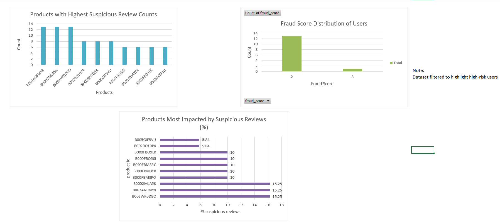

#  Fake Review Detection System

## Overview
This project focuses on identifying suspicious and potentially fake reviews in an e-commerce dataset using SQL, Python, and Excel.

The goal is to detect abnormal user behavior, suspicious products, and quantify the impact of fake reviews.

---

##  Objectives
- Detect suspicious users based on behavior patterns
- Identify products heavily impacted by fake reviews
- Analyze rating patterns and review spikes
- Present insights using an interactive dashboard

---

## Tools & Technologies
- SQL (MySQL)
- Python (Pandas, Matplotlib, Seaborn)
- Excel (Dashboard & Visualization)

---

## Key Analysis Performed

### 1. User Fraud Detection
- Users with extreme ratings (1 or 5)
- High number of reviews
- Multiple reviews in a single day

### 2. Fraud Scoring Model
Users were assigned a fraud score based on:
- Review count
- Rating behavior
- Daily activity

### 3. Product-Level Analysis
- Products with highest suspicious reviews
- Products with highest % of suspicious reviews

### 4. Text Analysis
- Duplicate review detection

### 5. Time-Based Analysis
- Detection of review spikes (burst activity)

---

## Dashboard Preview

---

## Key Insights
- Certain products have more than 15% suspicious reviews
- High-risk users show extreme rating behavior (1 or 5)
- Review spikes of up to 50 reviews/day indicate coordinated activity
- Suspicious reviews account for a small percentage overall but are concentrated on specific products

---

## Project Structure
'''
fake-review-detection-system/
│
├── data/
│   └── sample_review.csv
│
├── sql/
│   └── analysis.sql
|   └── creating_table.sql
│
├── python/
│   └── charts.py
|   └── basic_data_cleaning.py
│
├── dashboard/
│   └── review_fraud_detection.xlsx
│
├── images/
│   └── dashboard.png
|   └── dashboard2.png
|   └── fraud_score.png
|   └── rating_distribution.png
|   └── spike_detection.png
|   └── affected_products.png
|   └── percentage_suspicious_reviews.png
│
├── README.md
'''
---

## How to Run

1. Load dataset into MySQL
2. Run SQL queries from `analysis_queries.sql`
3. Run Python script: charts.py
4. Open Excel dashboard

---

## Conclusion
This project demonstrates how data analysis techniques can be used to detect fraudulent behavior and generate actionable business insights.
